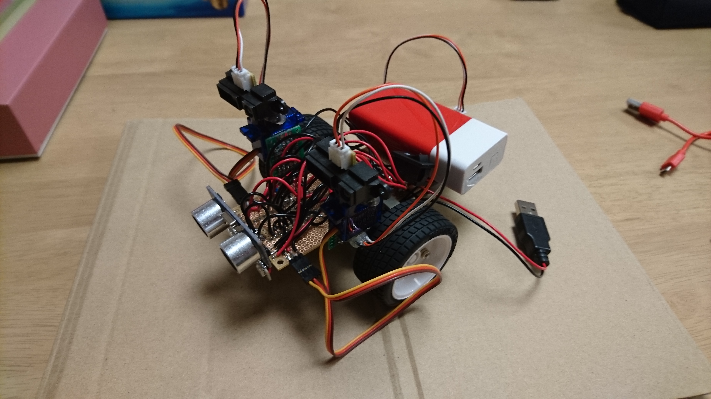
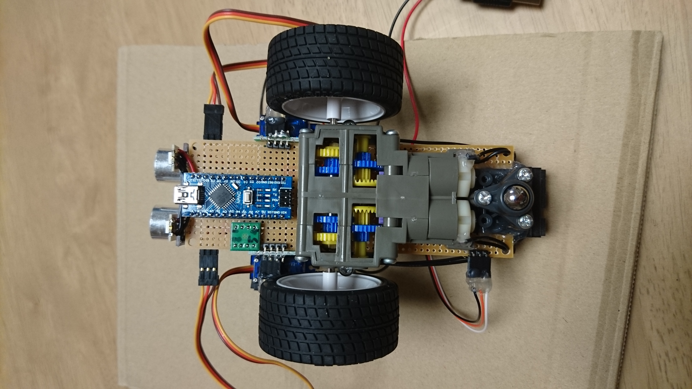

# LAV(Litte Autonomous Vehicle)

just started, under development

## Hardware

### Sensor

- 3 SHARP IR Rangefinder
- 1 Ultrasound Rangefinder
- 1 3-axis gyro sensor
- 
### Processor

- 1 Arduino Nano

### Actuator

- 1 Dual channel motor driver
- 2 Tamiya DC geared motor
- 2 5g Micro servo
- 2 WS2812 RGB LED
- 
### Power Source

- 5V 4000mAh Li-ion Mobile Battery with 5V 2000mA output capacity
### Other Mechanical parts

- 2 rubber wheels
- 1 caster wheel

## Function

I plan to add the following functions

- Display robot's status with the two RGB LEDs
- Scan the surrounding environment to avoid obstacles
- Map a static environment (I should add encoders to motors if I want this function. I can't imagine a vehicle can map an environment with only gyro and some poor distance sensors)

